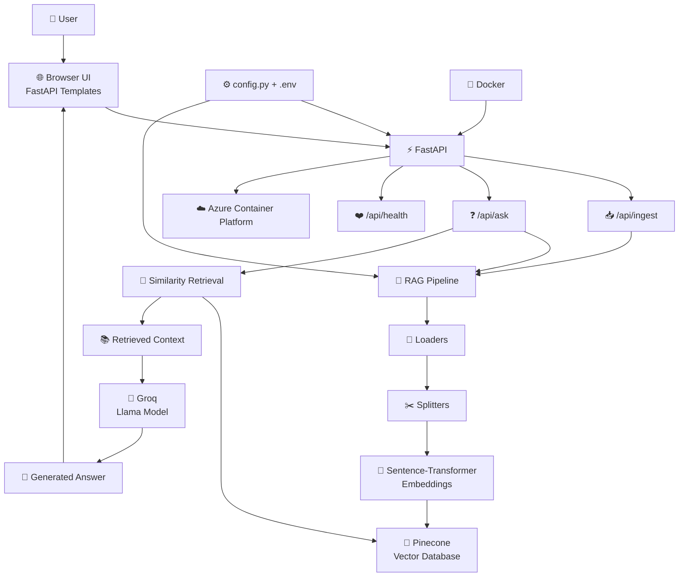
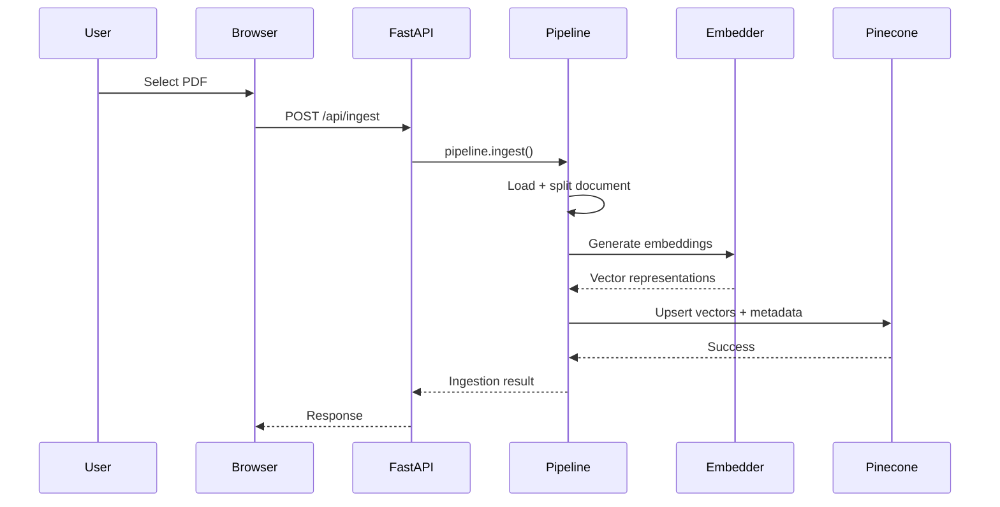
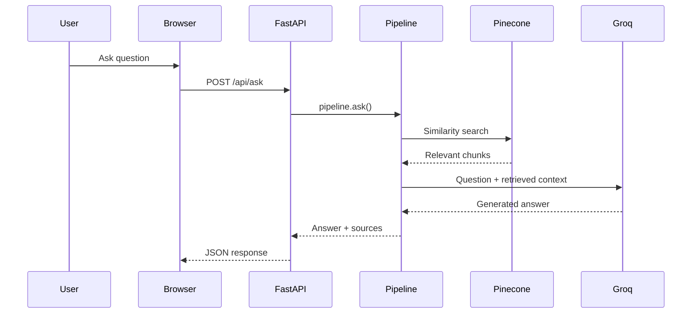
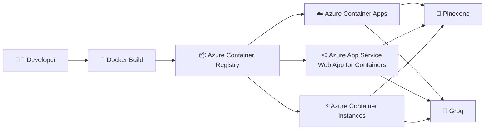

# 🚀 RAG Pipeline --- FastAPI + Docker + Azure

```{=html}
<p align="center">
```
`<strong>`{=html}Production-style Retrieval-Augmented Generation
API`</strong>`{=html}`<br/>`{=html} Upload PDFs → Ingest into Pinecone →
Retrieve relevant context → Generate answers with Groq
```{=html}
</p>
```
```{=html}
<p align="center">
```
``{=html}
``{=html}
``{=html}
``{=html}
``{=html}
``{=html}
```{=html}
</p>
```
```{=html}
<p align="center">
```
``{=html}
``{=html}
``{=html}
``{=html}
```{=html}
</p>
```

------------------------------------------------------------------------

## ✨ Overview

This project is the **web-service version of a RAG pipeline**.

It keeps the same core retrieval + generation workflow --- using
**Pinecone**, **sentence-transformers**, and **Groq** --- and wraps it
inside a **FastAPI application** with a browser-based interface.

The application is designed to:

-   📄 Upload PDF documents
-   🔍 Ingest and index document content
-   🧠 Generate embeddings with sentence-transformers
-   🗂️ Store/search vectors in Pinecone
-   🤖 Send retrieved context to Groq for answer generation
-   💬 Ask questions through a browser UI
-   📚 Return generated answers with source citations
-   🐳 Run locally inside Docker
-   ☁️ Deploy as a container to Azure

> **Core idea:** FastAPI is the HTTP/web layer around the existing RAG
> orchestration. The underlying `pipeline.ingest()` and `pipeline.ask()`
> workflow remains the central engine.

------------------------------------------------------------------------

# 🧠 What is RAG?

**Retrieval-Augmented Generation (RAG)** combines information retrieval
with an LLM.

Instead of asking the LLM to answer only from its internal knowledge,
the system first retrieves relevant information from your document
collection and then provides that information as context to the LLM.

### 🔄 High-level flow

``` text
             📄 PDF DOCUMENT
                    │
                    ▼
             ┌──────────────┐
             │   Load PDF   │
             └──────┬───────┘
                    │
                    ▼
             ✂️ Split / Chunk
                    │
                    ▼
             🧠 Embeddings
          sentence-transformers
                    │
                    ▼
             📌 Pinecone
             Vector Store
                    │
                    │  Similarity Search
                    ▼
             🔎 Relevant Chunks
                    │
                    ▼
             🤖 Groq LLM
                    │
                    ▼
          💬 Answer + Sources
```

------------------------------------------------------------------------

# 🏗️ System Architecture



------------------------------------------------------------------------

# 🔥 End-to-End Request Flow

## 1️⃣ Document Ingestion



## 2️⃣ Question Answering



------------------------------------------------------------------------

# 📁 Project Structure

``` text
rag_pipeline_fastapi/
│
├── main.py
│   └── FastAPI application
│       ├── Browser UI
│       ├── /api/ingest
│       ├── /api/ask
│       └── /api/health
│
├── pipeline.py
│   └── Core RAG orchestration
│
├── config.py
│   └── Environment/settings configuration
│
├── Dockerfile
│   └── Container image definition
│
├── .dockerignore
│   └── Files excluded from Docker build context
│
├── templates/
│   └── index.html
│       └── Browser chat/upload interface
│
├── static/
│   └── CSS / JS assets
│
├── loaders/
│   └── Document loading modules
│
├── splitters/
│   └── Document chunking modules
│
├── embeddings/
│   └── Embedding generation modules
│
├── vectorstores/
│   └── Pinecone integration
│
├── generators/
│   └── LLM generation modules
│
├── requirements.txt
│   └── Python dependencies
│
└── .env
    └── Local secrets/configuration
```

------------------------------------------------------------------------

# 🧩 Technology Stack

  Layer           Technology              Purpose
  --------------- ----------------------- -----------------------------
  🐍 Language     Python                  Application logic
  ⚡ API          FastAPI                 HTTP API + web server
  🖥️ UI           HTML / Templates        Browser interface
  📄 Documents    PDF                     Input knowledge source
  🧠 Embeddings   sentence-transformers   Convert text into vectors
  📌 Vector DB    Pinecone                Store and retrieve vectors
  🤖 LLM          Groq / Llama            Generate answers
  🐳 Container    Docker                  Package and run application
  ☁️ Cloud        Azure                   Container deployment

------------------------------------------------------------------------

# 🖥️ Application UI

The FastAPI application provides a browser interface with two main
workflows:

### 📤 Document Upload

``` text
┌───────────────────────────────────────────────────────┐
│                    📚 RAG ARCHIVE                     │
│                                                       │
│     ┌───────────────────────────────────────────┐     │
│     │        📄 Drop PDF files here             │     │
│     │                                           │     │
│     │              [ Choose Files ]             │     │
│     └───────────────────────────────────────────┘     │
│                                                       │
│              [ Ingest into archive ]                  │
└───────────────────────────────────────────────────────┘
```

### 💬 Question Answering

``` text
┌───────────────────────────────────────────────────────┐
│                   💬 ASK YOUR DOCUMENTS               │
│                                                       │
│  ┌─────────────────────────────────────────────────┐  │
│  │ What does the document say about ...?           │  │
│  └─────────────────────────────────────────────────┘  │
│                                                       │
│                       [ Ask ]                         │
│                                                       │
│  ┌─────────────────────────────────────────────────┐  │
│  │ 🤖 Answer                                       │  │
│  │                                                 │  │
│  │ Retrieved information is used to generate the   │  │
│  │ answer.                                         │  │
│  │                                                 │  │
│  │ 📚 Sources                                      │  │
│  │ • document/page/chunk ...                       │  │
│  └─────────────────────────────────────────────────┘  │
└───────────────────────────────────────────────────────┘
```

------------------------------------------------------------------------

# 📸 Screenshots

> The actual screenshots of your running application are intentionally
> **not fabricated**. Add your real screenshots to the paths below after
> running the project.

Create:

``` text
docs/
└── screenshots/
    ├── home.png
    ├── document-ingestion.png
    ├── question-answering.png
    └── api-response.png
```

Then add them to this README:

### 🏠 Home / Chat UI


### 📄 PDF Ingestion


### 💬 Question Answering


### 🔌 API Response


------------------------------------------------------------------------

# ⚙️ Environment Variables

Create a `.env` file from `.env.example`:

``` bash
cp .env.example .env
```

Configure the required API credentials:

``` env
PINECONE_API_KEY=your_pinecone_api_key
GROQ_API_KEY=your_groq_api_key
```

### 🔐 Security rule

**Never bake API keys into the Docker image or commit `.env` to Git.**

Use environment variables/secrets at runtime.

------------------------------------------------------------------------

# 🚀 Run Locally

## 1. Clone the repository

``` bash
git clone <your-repository-url>
cd rag_pipeline_fastapi
```

## 2. Create a virtual environment

### Windows

``` bash
python -m venv .venv
.venv\Scripts\activate
```

### Linux / macOS

``` bash
python3 -m venv .venv
source .venv/bin/activate
```

## 3. Install dependencies

``` bash
pip install -r requirements.txt
```

## 4. Configure environment variables

``` bash
cp .env.example .env
```

Fill in:

``` env
PINECONE_API_KEY=...
GROQ_API_KEY=...
```

## 5. Start FastAPI

``` bash
uvicorn main:app --reload
```

Open:

``` text
http://localhost:8000
```

------------------------------------------------------------------------

# 🐳 Run with Docker

## Build the image

``` bash
docker build -t rag-pipeline .
```

## Run the container

``` bash
docker run -p 8000:8000 --env-file .env rag-pipeline
```

Open:

``` text
http://localhost:8000
```

### 🐳 Container architecture

``` text
                 HOST MACHINE
                      │
                      │ :8000
                      ▼
        ┌─────────────────────────┐
        │     Docker Container    │
        │                         │
        │   FastAPI Application   │
        │          │              │
        │          ▼              │
        │      RAG Pipeline       │
        └──────────┬──────────────┘
                   │
          ┌────────┴────────┐
          ▼                 ▼
      Pinecone             Groq
      Vector DB            LLM API
```

------------------------------------------------------------------------

# 🤖 Why Groq Doesn't Need a Local Model

The application uses Groq's hosted inference service.

``` text
Your Azure / Docker Container
          │
          │ HTTPS API request
          │ + GROQ_API_KEY
          ▼
     api.groq.com
          │
          ▼
     Hosted Llama Model
          │
          ▼
    Generated Answer
```

Therefore, the container does **not** need to download or host the Llama
model locally.

The container simply makes an API call to Groq.

This keeps the container lightweight compared with hosting a local LLM.

------------------------------------------------------------------------

# 📌 API Reference

  Method   Endpoint        Body                      Purpose
  -------- --------------- ------------------------- -------------------
  `GET`    `/`             ---                       Serves browser UI
  `GET`    `/api/health`   ---                       Health check
  `POST`   `/api/ingest`   Multipart form, `files`   Ingest PDF files
  `POST`   `/api/ask`      JSON                      Ask a question

------------------------------------------------------------------------

## ❤️ Health Check

### Request

``` http
GET /api/health
```

Useful for checking whether the service is running and for
container/cloud health probes.

------------------------------------------------------------------------

## 📥 PDF Ingestion

### Request

``` http
POST /api/ingest
Content-Type: multipart/form-data
```

Field:

``` text
files
```

The endpoint sends the uploaded PDF(s) through the RAG ingestion
pipeline and stores the resulting vectors in Pinecone.

------------------------------------------------------------------------

## ❓ Ask a Question

### Request

``` http
POST /api/ask
Content-Type: application/json
```

Example:

``` json
{
  "question": "What is the main topic of the document?",
  "top_k": 4
}
```

### Response shape

``` json
{
  "answer": "Generated answer...",
  "sources": [
    "source information..."
  ]
}
```

------------------------------------------------------------------------

# 🧪 Testing the API with cURL

### Health

``` bash
curl http://localhost:8000/api/health
```

### Ask

``` bash
curl -X POST http://localhost:8000/api/ask \
  -H "Content-Type: application/json" \
  -d "{\"question\":\"What is this document about?\",\"top_k\":4}"
```

### Ingest

``` bash
curl -X POST http://localhost:8000/api/ingest \
  -F "files=@sample.pdf"
```

------------------------------------------------------------------------

# ☁️ Azure Deployment Architecture

The same Docker image can be used with multiple Azure container
services.



### Deployment options

  -----------------------------------------------------------------------
  Azure Service                       Best suited for
  ----------------------------------- -----------------------------------
  **Azure Container Apps**            Flexible containerized web
                                      workloads

  **Azure App Service --- Web App for Web application deployment
  Containers**                        

  **Azure Container Instances**       Quick/simple container demo
  -----------------------------------------------------------------------

All three can use the same Docker image.

------------------------------------------------------------------------

# 📦 Azure Deployment Flow

``` text
                    LOCAL MACHINE
                         │
                         ▼
                 docker build
                         │
                         ▼
                 🐳 Docker Image
                         │
                         ▼
              Azure Container Registry
                         │
                         ▼
                Select Azure Service
                 /       |        \
                /        |         \
               ▼         ▼          ▼
             ACA       App       ACI
               \         |        /
                \        |       /
                 ▼       ▼      ▼
                  RAG API
                     │
              ┌──────┴──────┐
              ▼             ▼
          Pinecone         Groq
```

------------------------------------------------------------------------

# 🔐 Azure Configuration

API keys should be supplied as **environment variables / secrets**
rather than being written into the image.

Conceptually:

``` text
Azure Container
      │
      ├── PINECONE_API_KEY
      ├── GROQ_API_KEY
      └── PORT
```

The application can then access the configuration through `config.py`.

------------------------------------------------------------------------

# 🔌 External Services

## 📌 Pinecone

Used as the vector database.

``` text
Documents
   ↓
Chunks
   ↓
Embeddings
   ↓
Pinecone
   ↓
Similarity Search
```

## 🤖 Groq

Used for LLM inference.

``` text
User Question
      +
Retrieved Context
      ↓
    Groq
      ↓
Generated Answer
```

------------------------------------------------------------------------

# 🧠 RAG Components

``` text
┌───────────────────────────────────────────────┐
│                  RAG PIPELINE                 │
├───────────────────────────────────────────────┤
│                                               │
│  📄 Loader                                    │
│      ↓                                        │
│  ✂️ Splitter                                  │
│      ↓                                        │
│  🧠 Embedding Model                           │
│      ↓                                        │
│  📌 Pinecone                                  │
│      ↓                                        │
│  🔎 Retrieval                                 │
│      ↓                                        │
│  📚 Context                                   │
│      ↓                                        │
│  🤖 Groq / Llama                              │
│      ↓                                        │
│  💬 Answer + Sources                           │
│                                               │
└───────────────────────────────────────────────┘
```

------------------------------------------------------------------------

# ⚡ Startup Optimization

The embedding model and Pinecone connection are loaded **once during
application startup**, rather than being initialized for every request.

Conceptually:

``` text
Application Startup
        │
        ├── Load configuration
        ├── Initialize embedding model
        └── Initialize Pinecone connection
                 │
                 ▼
            Ready to serve
                 │
       ┌─────────┴─────────┐
       ▼                   ▼
  /api/ingest          /api/ask
```

The first request after boot may therefore be slightly slower while the
model warms up.

------------------------------------------------------------------------

# 🌐 CORS

CORS is **not currently configured**.

That is sufficient when the browser UI and API are served from the same
FastAPI application.

If the frontend is later moved to another domain, add FastAPI's CORS
middleware.

Example:

``` python
from fastapi.middleware.cors import CORSMiddleware

app.add_middleware(
    CORSMiddleware,
    allow_origins=["https://your-frontend-domain.com"],
    allow_credentials=True,
    allow_methods=["*"],
    allow_headers=["*"],
)
```

For production, prefer explicitly listing trusted origins rather than
allowing every origin.

------------------------------------------------------------------------

# 🧱 Design Philosophy

This project follows a clean separation of responsibilities:

``` text
┌───────────────────────┐
│      Presentation     │
│  HTML / Browser UI    │
└───────────┬───────────┘
            │
┌───────────▼───────────┐
│       API Layer       │
│       FastAPI         │
└───────────┬───────────┘
            │
┌───────────▼───────────┐
│    RAG Orchestration  │
│      pipeline.py      │
└───────────┬───────────┘
            │
     ┌──────┼───────┐
     ▼      ▼       ▼
  Loader  Embedder  Generator
     │      │       │
     └──────┴───┬───┘
                ▼
             Pinecone
```

This makes it easier to:

-   Replace the UI
-   Change the API layer
-   Change the embedding implementation
-   Change the vector database
-   Change the LLM provider
-   Run the same RAG core from another application

------------------------------------------------------------------------

# 🛡️ Production Checklist

Before deploying publicly:

-   [ ] Never commit `.env`
-   [ ] Store API keys as Azure secrets/environment variables
-   [ ] Add authentication if the API is publicly accessible
-   [ ] Restrict CORS origins when using a separate frontend
-   [ ] Add request/file-size validation
-   [ ] Add structured logging
-   [ ] Add error handling around external APIs
-   [ ] Configure health checks
-   [ ] Verify Pinecone index configuration
-   [ ] Verify Groq API access
-   [ ] Test the Docker image locally before pushing
-   [ ] Test `/api/health` after Azure deployment

------------------------------------------------------------------------

# 🗺️ Project Roadmap

``` text
                         RAG PIPELINE
                              │
       ┌──────────────────────┼──────────────────────┐
       │                      │                      │
       ▼                      ▼                      ▼
   📄 Ingestion          🔎 Retrieval           🤖 Generation
       │                      │                      │
       └──────────────────────┼──────────────────────┘
                              │
                              ▼
                        ⚡ FastAPI API
                              │
                              ▼
                        🐳 Docker
                              │
                              ▼
                         ☁️ Azure
```

### Potential future improvements

-   🔐 API authentication
-   📊 Monitoring and observability
-   🧪 Automated tests
-   ⚡ Streaming LLM responses
-   📚 Multi-document management
-   👤 User-specific document collections
-   💾 Conversation history
-   🔎 Better source/citation rendering
-   🖥️ Separate production frontend
-   📈 Evaluation of retrieval quality

------------------------------------------------------------------------

# 🧑‍💻 Quick Start

``` bash
# 1. Install dependencies
pip install -r requirements.txt

# 2. Configure secrets
cp .env.example .env

# 3. Start locally
uvicorn main:app --reload

# 4. Or build Docker image
docker build -t rag-pipeline .

# 5. Run container
docker run -p 8000:8000 --env-file .env rag-pipeline
```

Then open:

``` text
http://localhost:8000
```

------------------------------------------------------------------------

# ⭐ Key Features

  Feature                                   Status
  --------------------------------- ----------------------
  PDF ingestion                               ✅
  Document chunking                           ✅
  Sentence-transformer embeddings             ✅
  Pinecone vector search                      ✅
  Groq LLM generation                         ✅
  Source citations                            ✅
  FastAPI REST API                            ✅
  Browser UI                                  ✅
  Docker support                              ✅
  Azure-ready container                       ✅
  Health endpoint                             ✅
  CORS                               ⚙️ Optional / future
  Authentication                          🔜 Future

------------------------------------------------------------------------

# 📜 License

Add your project's license here, for example:

``` text
MIT License
```

------------------------------------------------------------------------

# 👨‍💻 Author

**Bhababhanjan Panda**

> Built as a containerized RAG web service using FastAPI, Pinecone,
> sentence-transformers, Groq, Docker and Azure-ready deployment
> architecture.

------------------------------------------------------------------------

```{=html}
<p align="center">
```
`<strong>`{=html}📄 Your Documents → 🔎 Retrieval → 🧠 Context → 🤖 LLM
→ 💬 Answers`</strong>`{=html}
```{=html}
</p>
```
```{=html}
<p align="center">
```
⭐ If this project helped you, consider giving the repository a star!
```{=html}
</p>
```
