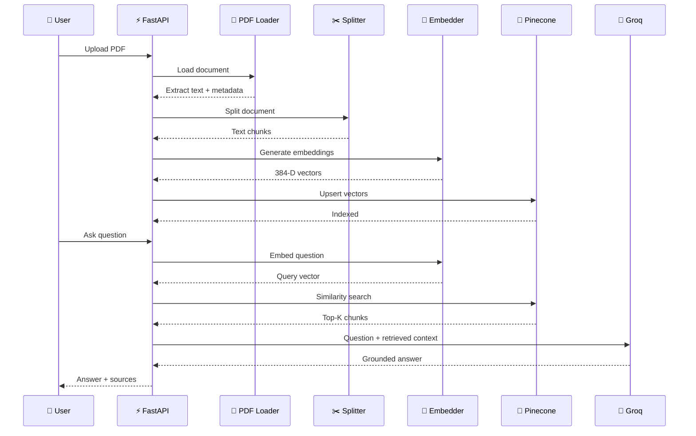
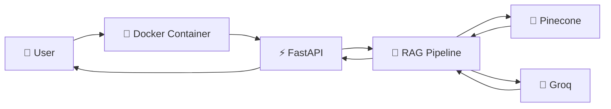

# 🚀 DocuFlux AI

### 📚 Intelligent Document Question Answering with Retrieval-Augmented Generation

<p align="center">


</p>

<p align="center">

**Turn your PDFs into a searchable, intelligent knowledge base.**

Upload documents → Build a vector index → Ask questions → Get grounded AI answers.

</p>

---

# 🌌 What is DocuFlux AI?

**DocuFlux AI** is an end-to-end **Retrieval-Augmented Generation (RAG)** application that allows users to upload PDF documents and interact with their contents using natural language.

Instead of sending an entire document directly to an LLM, DocuFlux AI:

1. 📄 Extracts text from PDFs
2. ✂️ Splits the text into manageable chunks
3. 🧠 Converts chunks into vector embeddings
4. 🗃️ Stores embeddings inside Pinecone
5. 🔎 Performs semantic similarity search
6. 🎯 Retrieves the most relevant chunks
7. 🤖 Sends retrieved context to Groq
8. 💬 Generates a grounded answer
9. 📌 Displays source document and page information

The core pipeline is explicitly organized into ingestion, retrieval, and answer-generation stages.

---

# ✨ Why DocuFlux AI?

Traditional document search depends heavily on exact keywords.

DocuFlux AI uses **semantic search**.

For example:

> **User:** "What are the main causes of climate change?"

Even if the PDF contains:

> "Major contributors to global warming include greenhouse gas emissions..."

the system can retrieve the relevant passage because the meaning is similar — not necessarily because the exact words match.

---

# 🧠 RAG at a Glance

```text
                     ┌──────────────────────┐
                     │      PDF DOCUMENT    │
                     └──────────┬───────────┘
                                │
                                ▼
                     ┌──────────────────────┐
                     │     PDF LOADER       │
                     │       PyPDF          │
                     └──────────┬───────────┘
                                │
                                ▼
                     ┌──────────────────────┐
                     │    TEXT SPLITTER     │
                     │  Chunk = 500 chars   │
                     │ Overlap = 50 chars   │
                     └──────────┬───────────┘
                                │
                                ▼
                     ┌──────────────────────┐
                     │    EMBEDDING MODEL   │
                     │ all-MiniLM-L6-v2     │
                     │     384 dimensions   │
                     └──────────┬───────────┘
                                │
                                ▼
                 ┌──────────────────────────────┐
                 │          PINECONE            │
                 │       Vector Database        │
                 │        Cosine Search         │
                 └──────────────┬───────────────┘
                                │
                         Top-K Retrieval
                                │
                                ▼
                     ┌──────────────────────┐
                     │     GROQ LLM         │
                     │  Grounded Generation │
                     └──────────┬───────────┘
                                │
                                ▼
                     ┌──────────────────────┐
                     │      AI ANSWER       │
                     │ + Source + Page      │
                     └──────────────────────┘
```

---

# 🏗️ System Architecture


---

# 🔥 Core Architecture

## 1️⃣ Document Ingestion

```text
PDF
 │
 ▼
PDFLoader
 │
 ▼
Extract text
 │
 ▼
Page metadata
 │
 ▼
TextSplitter
 │
 ▼
Chunks
```

The PDF loader extracts text page-by-page and preserves metadata including the original filename and page number.

---

## 2️⃣ Chunking

DocuFlux AI uses a lightweight recursive character splitter.

### Current configuration

| Parameter     |                                          Value |
| ------------- | ---------------------------------------------: |
| Chunk Size    |                                          `500` |
| Chunk Overlap |                                           `50` |
| Separators    | Paragraph → Line → Sentence → Word → Character |

The splitter recursively breaks large text while preserving overlap between neighboring chunks.

```text
Original Document

████████████████████████████████████████████████████

        ↓

Chunk 1
████████████████████

              Chunk 2
              ████████████████████

                            Chunk 3
                            ████████████████████

       ←── overlap ──→
```

The overlap helps preserve contextual continuity between chunks.

---

# 🧠 Embedding Layer

DocuFlux AI uses **Sentence Transformers** to convert text into numerical vectors.

Current default model:

```text
all-MiniLM-L6-v2
```

Dimension:

```text
384
```

The embedding wrapper provides separate methods for document embeddings and query embeddings and obtains the model's embedding dimension dynamically.

```text
Text
 │
 ▼
Sentence Transformer
 │
 ▼
[0.021, -0.184, 0.763, ...]
 │
 ▼
384-dimensional vector
```

---

# 🌲 Pinecone Vector Database

Pinecone stores the generated embeddings and their metadata.

Each vector contains:

```text
{
    id,
    values,
    metadata
}
```

Metadata includes:

```text
source
page
chunk_id
text
```

The Pinecone layer uses a serverless index and cosine similarity for vector search.

### Retrieval

```text
User Question
      │
      ▼
Query Embedding
      │
      ▼
Pinecone Similarity Search
      │
      ▼
Top-K Relevant Chunks
```

The current retrieval implementation defaults to:

```text
TOP_K = 4
```

and returns the retrieved text, source, page and similarity score.

---

# 🤖 Groq Generation

After retrieving relevant chunks, DocuFlux AI sends them to a Groq-hosted LLM.

The generator builds a context containing:

```text
[Source 1: document.pdf, page 4]
...

[Source 2: document.pdf, page 7]
...
```

and instructs the model to answer using only the provided context. If the context doesn't contain the answer, the system is instructed to respond:

> "I don't have enough information to answer that."

This grounding behavior is implemented directly in the Groq generator.

---

# 🔄 Complete RAG Flow



---

# 🖥️ User Interface

DocuFlux AI includes a modern dark-themed document command center.

The UI provides:

### 📚 Document Vault

* Drag & drop PDF upload
* Multiple PDF selection
* PDF validation
* Knowledge-index creation
* Ingestion status

### 💬 AI Research Desk

* Natural-language questions
* AI-generated answers
* Retrieved source information
* Page numbers
* Similarity scores

The frontend calls:

```text
POST /api/ingest
POST /api/ask
```

## and displays retrieved source/page information below answers.

# 📸 Screenshots

> Add your actual application screenshots here after running the project.

### 🏠 DocuFlux AI Dashboard

```text
docs/
└── screenshots/
    ├── dashboard.png
    ├── document-upload.png
    ├── ingestion.png
    └── rag-answer.png
```

Then add them to this README:

```markdown

```

### Recommended screenshots

| Screenshot   | What to capture               |
| ------------ | ----------------------------- |
| 🏠 Dashboard | Main DocuFlux AI interface    |
| 📄 Upload    | PDF upload screen             |
| ⚙️ Ingestion | Successful indexing           |
| 💬 Question  | User asking a question        |
| 🤖 Answer    | Grounded AI response          |
| 📌 Sources   | Answer with source/page/score |
| 🌲 Pinecone  | Indexed vectors               |
| 🐳 Docker    | Running container             |
| ☁️ Azure     | Deployed application          |

---

# 📁 Project Structure

```text
DocuFlux-AI/
│
├── main.py
├── pipeline.py
├── config.py
│
├── loaders/
│   └── pdf_loader.py
│
├── splitters/
│   └── text_splitter.py
│
├── embeddings/
│   └── sentence_transformer.py
│
├── vectorstores/
│   └── pinecone_store.py
│
├── generators/
│   └── groq_generator.py
│
├── templates/
│   └── index.html
│
├── data/
│   └── *.pdf
│
├── tests/
│   └── test_pinecone_store.py
│
├── requirements.txt
├── Dockerfile
├── .dockerignore
├── .gitignore
├── .env
└── README.md
```

---

# 🧩 Component Responsibilities

| Component                 | Responsibility                      |
| ------------------------- | ----------------------------------- |
| `main.py`                 | FastAPI application + API endpoints |
| `pipeline.py`             | Connects all RAG components         |
| `config.py`               | Environment-based configuration     |
| `pdf_loader.py`           | Extracts PDF text                   |
| `text_splitter.py`        | Creates overlapping chunks          |
| `sentence_transformer.py` | Generates embeddings                |
| `pinecone_store.py`       | Vector storage + similarity search  |
| `groq_generator.py`       | Generates grounded answers          |
| `index.html`              | Web interface                       |
| `test_pinecone_store.py`  | Pinecone behavior testing           |

The FastAPI application exposes the web UI, ingestion endpoint, question-answering endpoint and health endpoint.

---

# 🌐 API Endpoints

## `GET /`

Returns the DocuFlux AI web interface.

---

## `POST /api/ingest`

Uploads and indexes PDF files.

### Request

```text
multipart/form-data
files = PDF files
```

### Response

```json
{
  "message": "Ingested 1 file(s) successfully",
  "files": ["document.pdf"],
  "chunks_indexed": 42
}
```

---

## `POST /api/ask`

Ask a question about indexed documents.

### Request

```json
{
  "question": "What is the main topic of this document?",
  "top_k": 4
}
```

### Response

```json
{
  "answer": "The document mainly discusses...",
  "sources": [
    {
      "text": "...",
      "source": "document.pdf",
      "page": 3,
      "score": 0.87
    }
  ]
}
```

---

## `GET /api/health`

Health-check endpoint:

```json
{
  "status": "ok"
}
```

This is particularly useful when deploying the application to cloud infrastructure such as Azure.

---

# ⚙️ Configuration

Create a `.env` file:

```env
PINECONE_API_KEY=your_pinecone_api_key

PINECONE_INDEX_NAME=langchain-rag-384
PINECONE_CLOUD=aws
PINECONE_REGION=us-east-1

EMBEDDING_MODEL_NAME=all-MiniLM-L6-v2
EMBEDDING_DIMENSION=384

CHUNK_SIZE=500
CHUNK_OVERLAP=50

TOP_K=4

GROQ_API_KEY=your_groq_api_key
GROQ_MODEL=openai/gpt-oss-120b

DATA_DIR=./data
```

### 🔐 Important

Never commit your `.env` file.

Add:

```text
.env
```

to `.gitignore`.

The project's configuration layer is already designed around environment variables so API secrets don't need to be hardcoded.

---

# 📦 Requirements

Current project dependencies:

```txt
pinecone>=3.0.0
sentence-transformers>=2.2.2
pypdf>=4.0.0
python-dotenv>=1.0.0
numpy>=1.24.0
requests>=2.31.0
fastapi>=0.110.0
uvicorn[standard]>=0.29.0
python-multipart>=0.0.9
jinja2>=3.1.3
groq>=0.11.0
```

---

# 🚀 Installation

## 1. Clone the repository

```bash
git clone <YOUR_REPOSITORY_URL>
cd DocuFlux-AI
```

## 2. Create a virtual environment

### Windows

```bash
python -m venv venv
venv\Scripts\activate
```

### Linux / macOS

```bash
python3 -m venv venv
source venv/bin/activate
```

---

## 3. Install dependencies

```bash
pip install -r requirements.txt
```

---

## 4. Configure environment variables

Create:

```text
.env
```

and add your Pinecone and Groq credentials.

---

# ▶️ Run Locally

Start the FastAPI server:

```bash
uvicorn main:app --host 0.0.0.0 --port 8000 --reload
```

The application will be available at:

```text
http://localhost:8000
```

The same command is documented in the application itself for local development.

---

# 📄 Using DocuFlux AI

### Step 1 — Upload

Upload one or more PDF documents.

```text
📄 Research Paper
📄 Machine Learning Notes
📄 Company Report
```

### Step 2 — Build Index

Click:

```text
BUILD KNOWLEDGE INDEX
```

The application performs:

```text
PDF
 ↓
Text Extraction
 ↓
Chunking
 ↓
Embedding
 ↓
Pinecone Upsert
```

### Step 3 — Ask

Example:

```text
What are the major findings of this document?
```

### Step 4 — Retrieve

Pinecone searches for the most semantically similar chunks.

### Step 5 — Generate

Groq generates the final answer using the retrieved context.

### Step 6 — Inspect Sources

The UI displays:

```text
document.pdf · page 4 · 91% match
document.pdf · page 7 · 86% match
```

---

# 🧪 Testing

The project includes a test for Pinecone upsert/reset behavior using mocked Pinecone components.

Run:

```bash
pytest
```

The existing test verifies that reset-on-ingest can clear existing vectors before new vectors are inserted.

---

# 🐳 Docker

Build the image:

```bash
docker build -t docuflux-ai .
```

Run:

```bash
docker run -p 8000:8000 --env-file .env docuflux-ai
```

Then open:

```text
http://localhost:8000
```

### Docker Architecture



---

# ☁️ Azure Deployment

DocuFlux AI is designed so the FastAPI application can run inside a containerized cloud environment.

Recommended architecture:

```text
                   ☁️ Microsoft Azure
                         │
                         ▼
                ┌─────────────────┐
                │  Azure Container │
                │      App / Web   │
                │       App        │
                └────────┬────────┘
                         │
                         ▼
                  🐳 Docker Image
                         │
                         ▼
                    ⚡ FastAPI
                         │
              ┌──────────┴──────────┐
              ▼                     ▼
        🌲 Pinecone              🤖 Groq
       Vector Search           LLM Generation
```

Environment variables should be configured through the Azure deployment environment rather than committing credentials into the repository.

---

# 🔐 Security

Never expose:

```text
PINECONE_API_KEY
GROQ_API_KEY
```

inside:

* ❌ Python source code
* ❌ README
* ❌ GitHub commits
* ❌ Dockerfile
* ❌ screenshots
* ❌ frontend JavaScript

Use:

```text
.env
```

locally and environment configuration in production.

---

# 📊 Current RAG Configuration

```text
┌─────────────────────────────────────┐
│          DOCUFLUX CONFIG            │
├─────────────────────────────────────┤
│ Embedding Model : all-MiniLM-L6-v2 │
│ Dimensions      : 384               │
│ Chunk Size      : 500               │
│ Chunk Overlap   : 50                │
│ Top-K           : 4                 │
│ Vector Metric   : cosine             │
│ Vector DB       : Pinecone          │
│ LLM             : Groq              │
│ API             : FastAPI           │
│ Input           : PDF               │
└─────────────────────────────────────┘
```

---

# 🎯 Key Features

* 📄 Multi-PDF ingestion
* 🔍 Semantic vector search
* 🧠 Sentence Transformer embeddings
* 🌲 Pinecone vector database
* 🤖 Groq-powered generation
* 📚 Source-aware answers
* 📌 Page-level source information
* ⚡ FastAPI backend
* 🎨 Modern responsive UI
* 🐳 Docker-ready
* ☁️ Azure-ready
* 🧪 Automated testing
* 🔐 Environment-based secret management

---

# 🧠 Design Philosophy

DocuFlux AI follows a simple principle:

> **Retrieve first. Generate second.**

Instead of asking an LLM to blindly answer a question, the application first searches the user's document collection and supplies the most relevant context.

```text
                Traditional LLM

Question ───────────────► LLM
                             │
                             ▼
                         Answer
                      ❓ May hallucinate


                    DocuFlux AI

Question
   │
   ▼
Vector Search
   │
   ▼
Relevant Documents
   │
   ▼
Groq LLM
   │
   ▼
Grounded Answer
   │
   ▼
Sources + Pages
```

---

# 🔬 Technical Highlights

### PDF Processing

`pypdf` extracts text and page-level metadata from PDF files.

### Embeddings

Sentence Transformers converts documents and queries into dense vectors.

### Vector Search

Pinecone performs similarity search over stored embeddings.

### Generation

Groq generates answers using the retrieved document context.

### Pipeline

All components are orchestrated by `RAGPipeline`.

---

# 🚧 Future Improvements

The architecture can be extended with:

* 🔄 Streaming RAG responses
* 📑 Support for DOCX / TXT / HTML
* 🧠 Hybrid keyword + vector search
* 🔐 User authentication
* 👥 Multi-user document collections
* 🗂️ Document management
* 🧹 Duplicate-document detection
* 📊 Retrieval analytics
* 🧪 RAG evaluation metrics
* 📝 Conversation history
* 💾 Persistent chat sessions
* 🎯 Metadata filtering
* 🔀 Reranking models
* 📈 Observability and logging
* ⚡ Async ingestion
* ☁️ Azure Blob Storage
* 🔑 Azure Key Vault
* 📦 CI/CD with GitHub Actions

---

# 🛣️ Roadmap

```text
             DOCUFLUX AI ROADMAP

                    CURRENT
                       │
                       ▼
              ┌─────────────────┐
              │ PDF → RAG → LLM │
              └────────┬────────┘
                       │
          ┌────────────┼────────────┐
          ▼            ▼            ▼
       Streaming    Auth       More Formats
          │            │            │
          └────────────┼────────────┘
                       ▼
                 Hybrid Search
                       │
                       ▼
                   Reranking
                       │
                       ▼
                RAG Evaluation
                       │
                       ▼
              Production Platform
```

---

# 🏆 What This Project Demonstrates

This project demonstrates practical implementation of:

```text
Python
   │
   ├── FastAPI
   │
   ├── REST APIs
   │
   ├── PDF Processing
   │
   ├── Text Chunking
   │
   ├── NLP Embeddings
   │
   ├── Vector Databases
   │
   ├── Semantic Search
   │
   ├── RAG Architecture
   │
   ├── LLM Integration
   │
   ├── Docker
   │
   └── Cloud Deployment
```

It is therefore more than a chatbot — it is a complete **document intelligence pipeline**.

---

# 👨‍💻 Author

**Bhababhanjan Panda**

> Building practical AI, Machine Learning, Data Science and Full-Stack projects.

---

# ⭐ Support

If you found **DocuFlux AI** useful:

⭐ Star the repository
🍴 Fork the project
🐛 Report issues
💡 Suggest improvements
🚀 Build something with it

---

<p align="center">

### 💜 Built with Python + FastAPI + Pinecone + Sentence Transformers + Groq

**DocuFlux AI — Turn documents into knowledge.**

</p>
